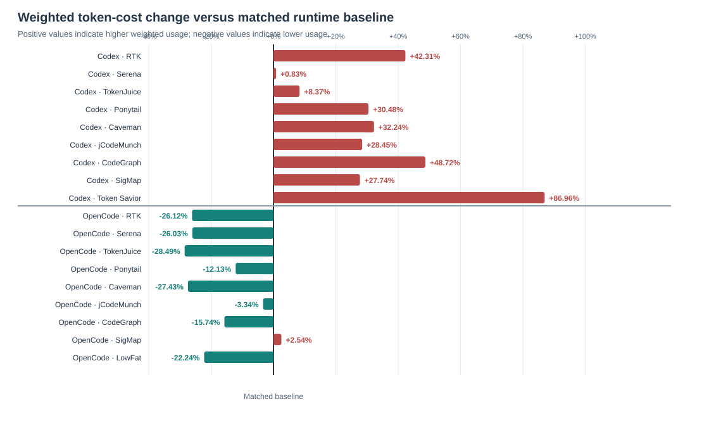
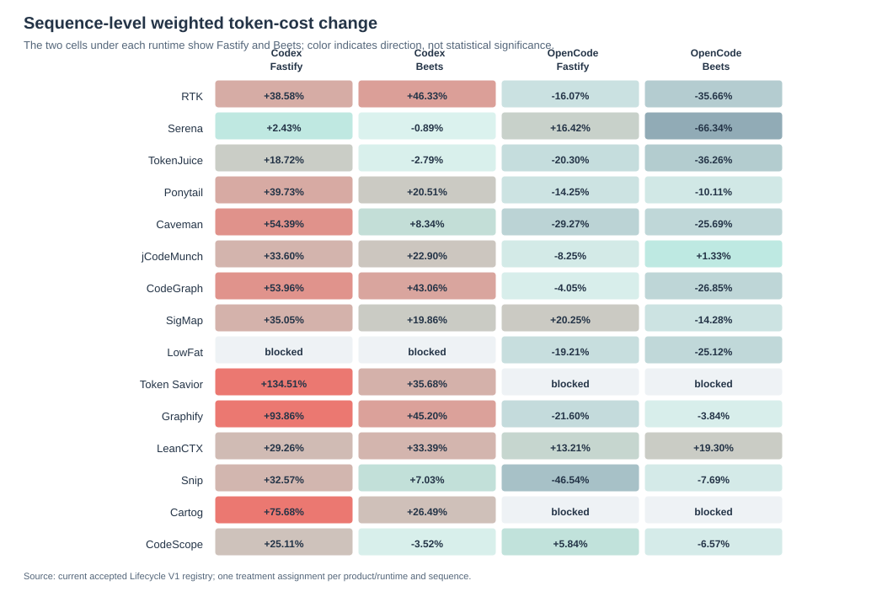
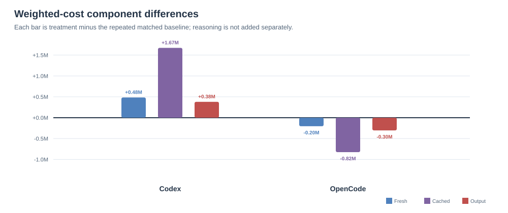

# Phase 2: Lifecycle V1 natural-use screening of token-saving integrations

> **Archived pre-correction evidence.** This report describes the exact prompt and protocol bytes executed before the 2026-08-13 task-family correction. Its 103-session corpus, protocols, and campaign audits are preserved in the [pre-correction archive](../../sources/evaluations/archive/lifecycle-v1-pre-corrected-prompts-20260813/), but they are not current findings or reusable controls. Fresh execution is required under the corrected Lifecycle V1 contract.

## Executive summary

- **Scope:** 27 matched product/runtime conditions, 54 persistent workflow sessions, and 162 accepted task outcomes across Fastify and Beets.
- **Codex:** 14 product profiles used **9,760,614.0 weighted token-cost units**, versus **7,224,529.2** for repeated bare-Codex baselines: **+35.10%**.
- **OpenCode:** 13 product profiles used **8,171,173.4 weighted token-cost units**, versus **9,503,696.8** for the matched no-treatment OpenCode runtime control: **-14.02%**.
- **Correctness:** all 162 accepted V1 tasks passed the active compile-based acceptance checks. Quality and maintainability were diagnostic, not token-eligibility gates.
- **Conclusion:** the screen shows a strong runtime × integration interaction. It does **not** establish a universally effective token-saving product or a stable ranking.

## Research question

Does assigning a documented token-saving integration reduce **weighted token cost** in a realistic persistent coding workflow, relative to the matched no-treatment condition for the same runtime?

The estimand is assignment to the installed, native product surface under natural use. The evaluator did not require tool calls, minimum uptake, or a passing implementation to retain a token sample.

## Experimental design

| Item | Definition |
|---|---|
| Workflow | Fastify and Beets; feature implementation, behavior-preserving refactor, code review/correction |
| Session model | Three sequential tasks in one persistent agent session |
| Codex condition | Codex CLI, OpenAI GPT-5.6 Sol, `high` reasoning; bare-Codex matched baseline |
| OpenCode condition | OpenCode CLI 1.18.9, OpenAI GPT-5.6 Sol, `high` reasoning; native no-treatment runtime control |
| Treatment policy | Pinned native integration; natural use; no evaluator-forced invocation |
| Primary measure | Weighted token cost |
| Accounting | `fresh input + 0.1 × cached input + 6 × output`; reasoning is an output subset and is not added again |
| Evidence snapshot | 2026-08-08; registry SHA-256 `324073e05a3aa79868515561714647bae1301eb4ab26b5ffb36f5c6b4764d359` |

The same two baseline sessions are repeated descriptively across conditions within each runtime. Repetition does not create independent controls. Codex and OpenCode are reported separately because their runtime surfaces, event schemas, and control conditions differ.

## Results

### Aggregate runtime results

| Runtime | Conditions | Treatment sessions | Tasks | Treatment weighted cost | Baseline weighted cost | Weighted change |
|---|---:|---:|---:|---:|---:|---:|
| Codex | 14 | 28 | 84/84 | 9,760,614.0 | 7,224,529.2 | +35.10% |
| OpenCode | 13 | 26 | 78/78 | 8,171,173.4 | 9,503,696.8 | -14.02% |

### Product/runtime contrasts

| Product | Codex weighted Δ | OpenCode weighted Δ | Codex tasks | OpenCode tasks |
|---|---:|---:|---:|---:|
| RTK | +42.31% | -26.12% | 6/6 | 6/6 |
| Serena | +0.83% | -26.03% | 6/6 | 6/6 |
| TokenJuice | +8.37% | -28.49% | 6/6 | 6/6 |
| Ponytail | +30.48% | -12.13% | 6/6 | 6/6 |
| Caveman | +32.24% | -27.43% | 6/6 | 6/6 |
| jCodeMunch | +28.45% | -3.34% | 6/6 | 6/6 |
| CodeGraph | +48.72% | -15.74% | 6/6 | 6/6 |
| SigMap | +27.74% | +2.54% | 6/6 | 6/6 |
| LowFat | — | -22.24% | blocked | 6/6 |
| Token Savior | +86.96% | — | 6/6 | blocked |
| Graphify | +70.45% | -12.49% | 6/6 | 6/6 |
| LeanCTX | +31.24% | +16.33% | 6/6 | 6/6 |
| Snip | +20.29% | -26.61% | 6/6 | 6/6 |
| Cartog | +52.02% | — | 6/6 | blocked |
| CodeScope | +11.34% | -0.52% | 6/6 | 6/6 |

Negative values indicate lower treatment usage. The table is descriptive; it is not a stable product ranking.

### Token accounting decomposition

| Runtime | Component | Treatment | Repeated baseline | Difference |
|---|---|---:|---:|---:|
| Codex | Fresh input | 2,897,706.0 | 2,413,866.0 | 483,840.0 |
| Codex | Cached input × 0.1 | 4,856,064.0 | 3,183,667.2 | 1,672,396.8 |
| Codex | Output × 6 | 2,006,844.0 | 1,626,996.0 | 379,848.0 |
| Codex | Weighted token cost | 9,760,614.0 | 7,224,529.2 | 2,536,084.8 |
| OpenCode | Fresh input | 2,446,257.0 | 2,650,076.0 | -203,819.0 |
| OpenCode | Cached input × 0.1 | 3,916,390.4 | 4,741,068.8 | -824,678.4 |
| OpenCode | Output × 6 | 1,808,526.0 | 2,112,552.0 | -304,026.0 |
| OpenCode | Weighted token cost | 8,171,173.4 | 9,503,696.8 | -1,332,523.4 |

In Codex, the weighted increase is distributed across fresh input, cached input, and output. In OpenCode, all three components decrease in aggregate; the cached-input reduction contributes most of the weighted reduction.

## Interpretation

### Codex

- 0 of 14 Codex profiles reduced weighted token cost in this screen.
- These Codex observations are descriptive screening evidence; they do not establish a stable product ranking.

### OpenCode

- 11 of 13 OpenCode profiles reduced weighted token cost in this screen.
- These are OpenCode-native integration observations. They should not be transferred to bare Codex, where the integration surface and trajectory differ.

### Runtime interaction

The Codex aggregate changed by +35.10% weighted, while the OpenCode aggregate changed by -14.02%. This is evidence of runtime-specific behavior, not proof that one runtime or product caused the full difference. Prompt serialization, caching, tool routing, command trajectories, and runtime accounting semantics remain potential contributors.

### Claude Code baseline model selection

As a separate model-selection experiment, direct first-party Anthropic Claude Code baselines ran the same Fastify and Beets Lifecycle V1 workflows with Sonnet 5/high and Opus 5/high. These baseline-only runs are not included in the 27 product/runtime treatment conditions above.

| Claude Code baseline | Weighted token cost across Fastify + Beets | Difference versus Sonnet 5 |
|---|---:|---:|
| Sonnet 5/high | 897,108.2 | — |
| Opus 5/high | 1,167,276.7 | +30.12% |

The Sonnet 5 baseline used +73.85% more weighted token cost than the matched Codex baseline pair (516,037.8) and +22.71% more than the matched OpenCode baseline pair (731,053.6). Because Opus 5 used materially more weighted token cost than Sonnet 5, while Claude Code already carries higher weighted baseline usage than both comparison runtimes, subsequent Claude Code treatment experiments continue with Sonnet 5/high. Opus 5 remains a completed baseline-only reference; this is a model-selection decision, not a treatment-effect estimate.

### Per-tool discussion

The measured component differences below identify where weighted cost changed; they do not establish why it changed. Mechanism explanations are source- and trace-grounded hypotheses that would require targeted ablations or replication to become causal claims.

#### RTK

**Measured outcome:** Codex +42.31% (largest component: cached input × 0.1 +133,196.8 units); OpenCode -26.12% (largest component: cached input × 0.1 -130,764.8 units). [RTK](../tool-dossiers/rtk-ai-rtk.md) rewrites eligible shell commands through guarded, command-specific output filters. The runtime split is consistent with integration depth: OpenCode can apply its native plugin automatically, while the Codex arm depended on routing instructions and included unsupported `rtk rg` and `rtk sed` forms that passed through. This is a mechanism-consistent inference, not a causal attribution.

#### Serena

**Measured outcome:** Codex +0.83% (largest component: cached input × 0.1 -18,662.4 units); OpenCode -26.03% (largest component: cached input × 0.1 -111,718.4 units). [Serena](../tool-dossiers/oraios-serena.md) uses language-server-style MCP tools to retrieve symbols instead of broad files. Its near-neutral Codex result suggests that retrieval savings approximately balanced the MCP and trajectory overhead there; the OpenCode reduction is consistent with more effective targeted retrieval, but the retained runs do not isolate tool uptake from runtime behavior.

#### TokenJuice

**Measured outcome:** Codex +8.37% (largest component: cached input × 0.1 +43,238.4 units); OpenCode -28.49% (largest component: cached input × 0.1 -119,859.2 units). [TokenJuice](../tool-dossiers/vincentkoc-tokenjuice.md) applies rule-driven command-output reducers through host hooks or plugins. The OpenCode reduction is consistent with automatic interception reducing terminal context, while the Codex increase indicates that any filtered output was outweighed by hook, cache, or trajectory effects in that runtime.

#### Ponytail

**Measured outcome:** Codex +30.48% (largest component: cached input × 0.1 +94,566.4 units); OpenCode -12.13% (largest component: cached input × 0.1 -51,353.6 units). [Ponytail](../tool-dossiers/dietrichgebert-ponytail.md) changes implementation policy toward smaller, simpler artifacts rather than compressing an input stream. That can reduce generated code or prose, but its persistent instructions can also change planning and tool trajectories. The opposite runtime directions therefore fit activation and trajectory differences better than a uniform compression effect.

#### Caveman

**Measured outcome:** Codex +32.24% (largest component: cached input × 0.1 +116,275.2 units); OpenCode -27.43% (largest component: cached input × 0.1 -109,670.4 units). [Caveman](../tool-dossiers/juliusbrussee-caveman.md) primarily compresses assistant prose, not shell output or retrieved code. The Codex trace did not show clear behavioral activation, so fixed guidance and unchanged tool context could dominate there. The OpenCode reduction is compatible with terser responses or a shorter trajectory, but the run does not identify which mechanism produced it.

#### jCodeMunch

**Measured outcome:** Codex +28.45% (largest component: cached input × 0.1 +125,440.0 units); OpenCode -3.34% (largest component: output × 6 -29,544.0 units). [jCodeMunch](../tool-dossiers/jgravelle-jcodemunch-mcp.md) offers token-budgeted symbol retrieval through a large MCP schema and installed guidance. The small OpenCode reduction and larger Codex increase are consistent with fixed schema/guidance overhead being repaid only when retrieval displaces enough native reading; these runs do not provide a no-guidance or tool-uptake ablation.

#### CodeGraph

**Measured outcome:** Codex +48.72% (largest component: cached input × 0.1 +167,526.4 units); OpenCode -15.74% (largest component: cached input × 0.1 -88,012.8 units). [CodeGraph](../tool-dossiers/cognitx-leyton-codegraph.md) replaces broad source exploration with bounded graph queries over a prebuilt Neo4j index. The OpenCode reduction is consistent with focused queries displacing file reads, whereas the Codex increase suggests that graph instructions, returned context, or extra turns exceeded the avoided reads.

#### SigMap

**Measured outcome:** Codex +27.74% (largest component: cached input × 0.1 +77,670.4 units); OpenCode +2.54% (largest component: output × 6 +17,742.0 units). [SigMap](../tool-dossiers/manojmallick-sigmap.md) exposes signatures, dependency maps, routing, and session memory. Neither runtime showed a meaningful reduction: the OpenCode result was close to neutral and Codex was higher. A plausible explanation is that these small tasks were already navigable with native search, leaving index, MCP, and returned-map overhead without enough displaced context.

#### LowFat

**Measured outcome:** OpenCode -22.24% (largest component: cached input × 0.1 -99,737.6 units). [LowFat](../tool-dossiers/zdk-lowfat.md) automatically filters supported command output and preserves raw failure logs. Its OpenCode reduction is consistent with a narrow automatic layer saving terminal context without requiring a model retrieval decision. Coverage is limited to supported commands, and no qualified Codex condition exists for a runtime comparison.

#### Token Savior

**Measured outcome:** Codex +86.96% (largest component: cached input × 0.1 +302,310.4 units). [Token Savior](../tool-dossiers/mibayy-token-savior.md) combines retrieval, indexing, memory, compact summaries, and optional Bash rewriting. Its large Codex increase is consistent with a broad multi-surface integration adding schemas, state, and tool turns faster than it removed context. Because the treatment is integrated, this screen cannot identify which component drove the increase.

#### Graphify

**Measured outcome:** Codex +70.45% (largest component: cached input × 0.1 +214,451.2 units); OpenCode -12.49% (largest component: cached input × 0.1 -60,416.0 units). [Graphify](../tool-dossiers/safishamsi-graphify.md) supplies a warm graph plus host-specific skills, instructions, and plugins. OpenCode's always-on policy can place graph guidance directly on shell calls, which may help explain its reduction; the Codex increase is consistent with graph and guidance overhead without enough displaced reading. The cross-runtime contrast remains descriptive.

#### LeanCTX

**Measured outcome:** Codex +31.24% (largest component: cached input × 0.1 +109,824.0 units); OpenCode +16.33% (largest component: cached input × 0.1 +62,412.8 units). [LeanCTX](../tool-dossiers/yvgude-lean-ctx.md) is a broad hybrid layer spanning MCP retrieval, compressed reads, search, shell output, memory, and a warm index. Both runtimes used more weighted tokens, consistent with its multi-surface context and extra interaction costs exceeding any local compression. A component ablation would be required to distinguish retrieval, shell, and guidance effects.

#### Snip

**Measured outcome:** Codex +20.29% (largest component: cached input × 0.1 +81,510.4 units); OpenCode -26.61% (largest component: cached input × 0.1 -117,350.4 units). [Snip](../tool-dossiers/edouard-claude-snip.md) rewrites supported shell producers through command-specific filters. The OpenCode reduction is consistent with effective automatic interception, while the Codex increase suggests lower rewrite coverage, pass-throughs, or a longer recovery trajectory. The retained evidence does not separate those possibilities.

#### Cartog

**Measured outcome:** Codex +52.02% (largest component: cached input × 0.1 +182,886.4 units). [Cartog](../tool-dossiers/jrollin-cartog.md) provides indexed graph navigation and token-bounded task-context bundles. The Codex increase indicates that indexing guidance, query responses, or longer tool chains exceeded the broad reads they may have replaced. OpenCode was excluded before provider execution because the pinned binary failed artifact-identity verification, so that absence is not a performance result.

#### CodeScope

**Measured outcome:** Codex +11.34% (largest component: cached input × 0.1 +42,163.2 units); OpenCode -0.52% (largest component: fresh input +17,070.0 units). [CodeScope](../tool-dossiers/onur-gokyildiz-bhi-codescope.md) combines graph/search tools with large-output archiving and optional compaction. Its OpenCode result was effectively neutral and Codex was modestly higher, consistent with bounded retrieval roughly balancing setup, schema, and tool-call overhead in one runtime but not the other. A near-zero single-run delta should not be read as a stable win.

## Blocked combinations

- **LowFat / Codex:** No qualified native Codex integration; no PATH-only or generic adapter substitution.
- **Token Savior / OpenCode:** No qualified native OpenCode integration; no generic adapter substitution.
- **Cartog / OpenCode:** The pinned native binary did not reproduce the frozen artifact identity; no provider execution was attempted.

These combinations produced no provider-backed treatment result and are excluded from the treatment totals.

## Limitations

- Each product/runtime condition has one treatment assignment per workflow; there is no within-condition replicate.
- Repeated baselines are descriptive and do not provide 27 independent control pairs.
- The two workflows cover only TypeScript and Python projects; results may not generalize to other repositories or task families.
- Weighted token cost is the sole outcome reported here. It is a declared accounting convention, not monetary cost.
- The weighted account does not identify which exact prompt, cached context, tool result, or trajectory step produced a difference.
- Compile/verifier success does not establish equal maintainability, correctness outside the tested contracts, latency, CPU cost, memory cost, or operational cost.
- Cross-runtime contrasts are screening evidence. They are not a causal comparison of Codex versus OpenCode.

## Conclusion

Lifecycle V1 shows that token-saving integrations can reduce **weighted token cost** in one runtime and increase it in another. In this screen, 0 of 14 Codex treatment conditions and 11 of 13 OpenCode conditions were below the matched weighted baseline. The result supports runtime-specific replication and better trajectory instrumentation—not a universal token-saving claim or deployment recommendation.

## Data availability

- Archived registry snapshot: [`workflow-sessions-registry.json`](../../sources/evaluations/archive/lifecycle-v1-pre-corrected-prompts-20260813/workflow-sessions-registry.json)
- Derived report dataset: [`phase-2-lifecycle-v1-report-data-20260808.json`](../../sources/evaluations/archive/lifecycle-v1-pre-corrected-prompts-20260813/audits/phase-2-lifecycle-v1-report-data-20260808.json)
- Cumulative Codex usage audit: [`codex-cumulative-usage-accounting-20260718.json`](../../sources/evaluations/archive/lifecycle-v1-pre-corrected-prompts-20260813/audits/codex-cumulative-usage-accounting-20260718.json)
- Archived compact workflow evidence: [`workflow-sessions/`](../../sources/evaluations/archive/lifecycle-v1-pre-corrected-prompts-20260813/workflow-sessions/)
